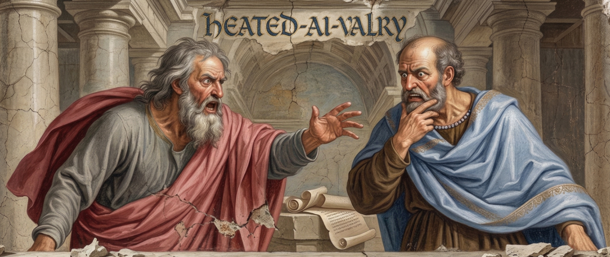

# Heated-Ai-valry

Have a question worth getting right? A document that can't afford a flaw? Don't trust a single pass — let two agents destroy it until what's left is the best version possible.

# How it works
😠 One agent (the Maximiser) pushes for boldness, impact, and ambition.

😧 The other (the Skeptic) demands evidence, correctness, and feasibility.

🗣️For N rounds, each agent produces an independent answer and viciously critique one another.

⚖️ A battle-tested consensus is reached.

## Usage

```
/debate "What is the best strategy for learning AI tooling as a developer?"
```

### Examples

```
/debate "tighten this resume" @resume.md
/debate "produce me the optimum roadmap for learning how to write agentic workflows" @report.md
/debate --rounds 5 "stress test this argument" @proposal.md
/debate --quick "fix the tone" @email.txt
/debate "best approach to caching in this system"
```

### Flags

| Flag | Default | Description |
|---|---|---|
| `--quick` | off | Single-pass edit, skips the full debate |
| `--rounds N` | 2 | Number of resolution rounds (max 10, or more if you dare) |
| `--model opus\|sonnet\|haiku` | sonnet | Model used for sub-agents |
| `--no-steer` | off | Skip steering checkpoints between rounds |

### Modes

- **File debate** — provide a `@file` reference. Agents refine the file content. You can save the result back.
- **Topic debate** — no file, just a question or idea. Agents debate the concept and produce a structured response.

## How it works

1. **Parse** flags and identify input type (prose, code, or concept)
2. **Criteria** — the orchestrator defines success criteria and assigns them across roles
3. **Independent drafts** — both agents produce full versions in parallel, each optimising for their owned criteria
4. **Disagreements** — the orchestrator surfaces 3-7 specific points of conflict
5. **Resolution rounds** — agents take turns resolving disagreements, with cross-review after each round. Early exit on approval.
6. **Output** — journey summary, tradeoffs, semantic diff, and the final version

## License

MIT
